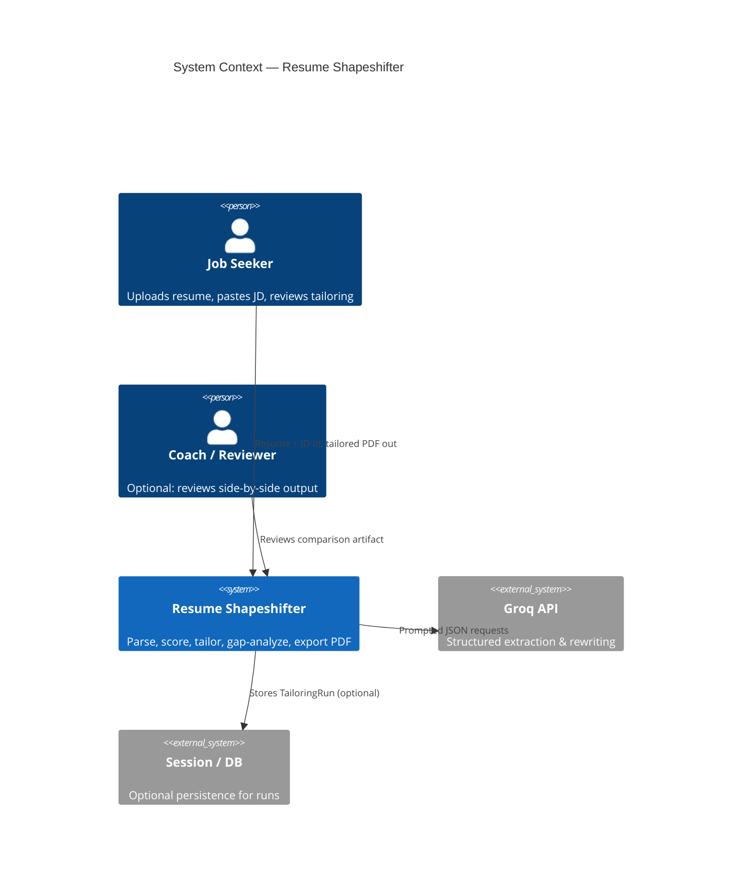
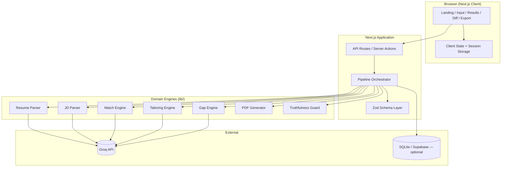
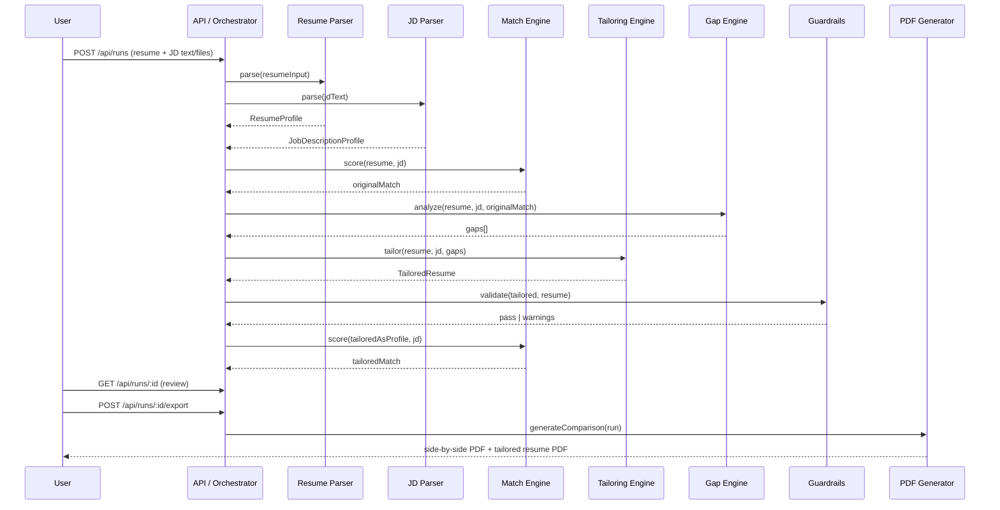
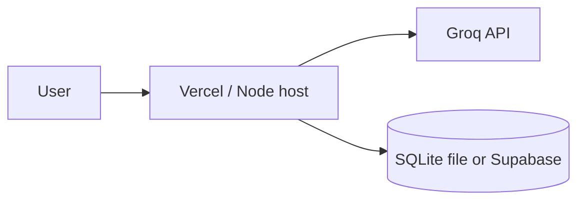

# Resume Shapeshifter — System Architecture

> **Product:** JD-to-resume tailoring engine that rewrites bullets truthfully, scores match quality, surfaces gaps, and exports a side-by-side proof PDF.  
> **Source:** Derived from [problemStatement.md](./problemStatement.md).

---

## Table of Contents

1. [Architecture Goals](#1-architecture-goals)
2. [System Context](#2-system-context)
3. [High-Level Architecture](#3-high-level-architecture)
4. [Core Domain Model](#4-core-domain-model)
5. [Processing Pipeline](#5-processing-pipeline)
6. [Service Layer](#6-service-layer)
7. [LLM Orchestration](#7-llm-orchestration)
8. [Truthfulness & Guardrails](#8-truthfulness--guardrails)
9. [Frontend Architecture](#9-frontend-architecture)
10. [API Design](#10-api-design)
11. [PDF Generation](#11-pdf-generation)
12. [Data & Storage](#12-data--storage)
13. [Validation & Error Handling](#13-validation--error-handling)
14. [Security & Privacy](#14-security--privacy)
15. [Observability](#15-observability)
16. [Deployment Topology](#16-deployment-topology)
17. [Implementation Phases](#17-implementation-phases)
18. [Risks & Mitigations](#18-risks--mitigations)
19. [Repository Layout](#19-repository-layout)
20. [Definition of Done (Architecture)](#20-definition-of-done-architecture)

---

## 1. Architecture Goals

| Goal | Description |
|------|-------------|
| **Truthfulness first** | No fabricated employers, degrees, tools, or metrics. Uncertain output is labeled and requires user confirmation. |
| **Explainability** | Every score, rewrite, and gap includes human-readable evidence tied to resume or JD text. |
| **Structured I/O** | All engine boundaries use validated JSON (Zod schemas) so UI, APIs, and PDFs share one contract. |
| **Vertical slice** | MVP delivers paste-in → analyze → tailor → review → export PDF in one coherent flow. |
| **Separation of concerns** | Parsing, scoring, tailoring, gaps, and rendering are independent modules with clear inputs/outputs. |
| **Portfolio-ready demo** | End-to-end run on a real JD + resume with a polished comparison PDF as the proof artifact. |

### Non-Goals (MVP)

- Auto-apply to jobs, large-scale job-board scraping, ATS guarantees, cover letters, perfect multi-column layout parsing.

---

## 2. System Context



**Primary actors:** Job seekers (primary), career coaches / reviewers (secondary).  
**External dependencies:** [Groq](https://groq.com/) LLM API using the `GROQ_API_KEY` for structured extraction and rewriting, JSON mode, optional object storage for uploads, PDF render engine.

---

## 3. High-Level Architecture

Recommended MVP stack: **Next.js full-stack** (App Router) with TypeScript, Tailwind, Shadcn UI. Document parsing and PDF generation may delegate to a **Python FastAPI sidecar** only if Node libraries prove insufficient; default to a single deployable unit for simplicity.



### Layer Responsibilities

| Layer | Responsibility |
|-------|----------------|
| **Presentation** | Forms, wizards, side-by-side diff, score cards, export triggers |
| **API / Orchestration** | Auth-less MVP routes; run `TailoringRun` pipeline; rate-limit LLM calls |
| **Domain engines** | Pure(ish) functions: input schema → output schema |
| **Infrastructure** | LLM client, file parsers, PDF renderer, optional DB |
| **Cross-cutting** | Zod validation, logging, guardrails, disclaimers |

---

## 4. Core Domain Model

All types are defined once in `lib/schemas.ts` (Zod) and exported as TypeScript types.

### 4.1 ResumeProfile

Parsed canonical resume used by all downstream engines.

```typescript
ResumeProfile {
  contact: { name?, email?, phone?, location?, links? }
  summary: string
  skills: string[]
  experience: ExperienceEntry[]
  projects: ProjectEntry[]
  education: EducationEntry[]
  certifications: CertificationEntry[]
  rawText?: string          // audit / re-parse
  parseWarnings?: string[]   // e.g. column order issues
}

ExperienceEntry {
  company: string
  title: string
  startDate?: string
  endDate?: string
  bullets: string[]
}
```

### 4.2 JobDescriptionProfile

Structured JD extracted from pasted text (URL fetch is post-MVP).

```typescript
JobDescriptionProfile {
  jobTitle: string
  company?: string
  requiredSkills: string[]
  preferredSkills: string[]
  responsibilities: string[]
  qualifications: string[]
  tools: string[]
  keywords: string[]
  seniorityLevel: "intern" | "junior" | "mid" | "senior" | "staff" | "unknown"
  domainSignals: string[]
  rawText?: string
}
```

### 4.3 MatchScore

Explainable 0–100 scoring with sub-scores.

```typescript
MatchScore {
  overallScore: number              // 0-100
  skillCoverageScore: number
  responsibilityAlignmentScore: number
  keywordScore: number
  seniorityScore: number
  criticalMissingRequirements: string[]
  explanation: string               // short narrative
  evidence?: MatchEvidence[]        // optional bullet/skill refs
}
```

### 4.4 TailoredResume

Output of tailoring engine; bullets carry metadata for UI and PDF.

```typescript
TailoredResume {
  tailoredSummary: string
  tailoredSkills: string[]          // reordered / grouped, not invented
  tailoredExperience: TailoredExperienceEntry[]
  tailoredProjects?: TailoredProjectEntry[]
  unchangedSections?: string[]      // e.g. education copied verbatim
}

TailoredBullet {
  original: string
  tailored: string
  changeReason: string
  keywordsAddressed: string[]
  confidence: "high" | "medium" | "low"
  riskFlag?: string                 // e.g. "may overstate scope"
  userConfirmed?: boolean           // set in review UI before export
}
```

### 4.5 ResumeGap

Gap analysis item with actionable guidance.

```typescript
ResumeGap {
  name: string
  importance: "high" | "medium" | "low"
  jdEvidence: string
  resumeEvidence: string            // empty if absent
  suggestedAction: string
  canSafelyAdd: boolean             // false → never auto-inject
}
```

### 4.6 TailoringRun (aggregate)

Single unit of work from user submission to export.

```typescript
TailoringRun {
  id: string
  createdAt: string
  status: "pending" | "parsing" | "analyzing" | "tailoring" | "complete" | "failed"
  resume: ResumeProfile
  jobDescription: JobDescriptionProfile
  originalMatch: MatchScore
  tailoredMatch?: MatchScore
  tailoredResume?: TailoredResume
  gaps?: ResumeGap[]
  errors?: string[]
}
```

---

## 5. Processing Pipeline

The orchestrator executes stages in order. Stages 4–6 may run **original match** before tailoring and **tailored match** after assembly.



### Stage Contracts

| Stage | Input | Output | LLM? |
|-------|--------|--------|------|
| Resume parse | text / PDF / DOCX | `ResumeProfile` | Optional cleanup pass |
| JD parse | pasted text | `JobDescriptionProfile` | Yes (extraction) |
| Match (original) | resume + JD | `MatchScore` | Yes (scoring) |
| Gap analysis | resume + JD + match | `ResumeGap[]` | Yes |
| Tailor | resume + JD + gaps | `TailoredResume` | Yes (rewrite) |
| Match (tailored) | tailored + JD | `MatchScore` | Yes |
| Guardrails | tailored + original | warnings / block flags | Rules + LLM audit (phase 4) |
| PDF export | full `TailoringRun` | binary PDFs | No |

---

## 6. Service Layer

Each service is a module under `lib/` with a single public function and internal prompt/utility helpers.

### 6.1 Resume Parsing Service (`lib/resume-parser.ts`)

**Responsibilities**

- Accept plain text, PDF (`pdf-parse`), or DOCX (`mammoth`).
- Normalize section headers (Experience, Work History, Employment → `experience`).
- Emit `ResumeProfile` JSON; attach `parseWarnings` on low confidence.

**Strategy**

1. **Deterministic extract** where possible (regex section split, date patterns).
2. **LLM cleanup** only when structure is ambiguous; prompt constrained to reorganize, not invent.
3. Preserve verbatim bullets in `original` fields before any tailoring.

**Edge cases:** Multi-column PDFs, non-standard section names → warn user; prefer pasted text fallback in UI.

### 6.2 JD Parsing Service (`lib/jd-parser.ts`)

**Responsibilities**

- Extract title, company, skills (required vs preferred), tools, responsibilities, qualifications, seniority, domain keywords.
- Deduplicate and normalize skill strings (e.g. "Node.js" / "NodeJS").

**Output:** `JobDescriptionProfile` via strict JSON schema prompt.

### 6.3 Match Engine (`lib/scoring.ts`)

**Responsibilities**

- Compute sub-scores: skill coverage, responsibility alignment, keywords, seniority.
- Aggregate to `overallScore` with documented weighting (config in `lib/scoring-weights.ts`).
- List `criticalMissingRequirements` and narrative `explanation`.

**Design note:** Scores are **heuristic + LLM-assisted**, not statistical truth. UI must label them as estimates.

Suggested default weights (tunable):

| Dimension | Weight |
|-----------|--------|
| Required skill coverage | 35% |
| Responsibility alignment | 25% |
| Keyword alignment | 20% |
| Seniority alignment | 10% |
| Preferred skill coverage | 10% |

### 6.4 Tailoring Engine (`lib/tailoring.ts`)

**Responsibilities**

- Rewrite bullets, optionally summary and skills **ordering** (not invention).
- Attach per-bullet metadata: reason, keywords, confidence, risk.
- Respect gap engine output: do not "fill" `canSafelyAdd: false` gaps.

**Rules (enforced in prompt + post-validation)**

- Same employers, titles, dates, education, certifications unless user edits manually.
- No new metrics unless present in source bullet.
- JD terminology only when supported by resume evidence.

### 6.5 Gap Analysis Service (`lib/gaps.ts`)

**Responsibilities**

- Compare JD requirements to resume evidence.
- Classify importance (high / medium / low) from JD language ("must", "required", vs "nice to have").
- Emit `suggestedAction` from a fixed enum (see problem statement §7.6).

### 6.6 PDF Generation Service (`lib/pdf.ts`)

**Responsibilities**

- **Tailored resume PDF:** clean single-column resume layout.
- **Comparison PDF (proof artifact):** header, scores, JD summary, two-column bullets, highlights, gap table, disclaimer.

**Implementation options (pick one for MVP)**

| Approach | Pros | Cons |
|----------|------|------|
| React-PDF (`@react-pdf/renderer`) | Component reuse, TS-native | Layout learning curve |
| Playwright / Puppeteer HTML → PDF | Pixel-perfect from React page | Heavier dep, server memory |
| `@react-pdf` + HTML template for comparison only | Split concerns | Two render paths |

**Recommendation:** Render comparison view as a dedicated Next.js **print route** (`/export/[runId]`) and use Playwright PDF in API route for MVP fidelity; migrate to React-PDF if dependency weight is a concern.

### 6.7 Pipeline Orchestrator (`lib/pipeline.ts`)

- Creates `TailoringRun`, updates `status`, catches errors per stage.
- Supports **sync MVP** (single long request) and later **async** (job queue + polling) without changing engine interfaces.

---

## 7. LLM Orchestration

### 7.1 Prompt Modules

One file per concern under `prompts/`:

| File | Purpose |
|------|---------|
| `jd-extraction.ts` | JD → `JobDescriptionProfile` |
| `resume-parser.ts` | Messy text → `ResumeProfile` cleanup |
| `match-scoring.ts` | Pair → `MatchScore` |
| `bullet-rewriter.ts` | Bullets + JD context → `TailoredBullet[]` |
| `gap-analysis.ts` | Pair → `ResumeGap[]` |
| `resume-assembly.ts` | Summary + skills ordering (optional) |

Shared utilities: `prompts/system-truthfulness.ts` (global rules injected into every call).

### 7.2 Prompt Contract

Every production prompt includes:

1. **Role** — expert resume editor, not fiction writer.
2. **Hard rules** — no invented employers, degrees, tools, metrics, or seniority.
3. **Output format** — JSON only, matching Zod schema; no markdown fences in production.
4. **Evidence rule** — cite resume phrase when adding JD keyword.
5. **Uncertainty** — use `confidence: low` and `riskFlag` when stretching alignment.

### 7.3 LLM Client (`lib/llm.ts`)

Uses the **Groq API** (`https://api.groq.com`) directly as the LLM provider using the `GROQ_API_KEY` via the official `groq-sdk` package (or `fetch` to its endpoint). Groq provides fast inference on models such as `llama-3.3-70b-versatile` and `llama-3.1-8b-instant`.

```typescript
// Pseudointerface
completeStructured<T>({
  prompt: string,
  schema: ZodSchema<T>,
  model?: string,        // defaults to process.env.GROQ_MODEL
  temperature?: number,
  maxRetries?: number,
}): Promise<T>
```

**Provider configuration**

| Setting | Env var | Example |
|---------|---------|---------|
| API key | `GROQ_API_KEY` | `gsk_...` from [Groq Console](https://console.groq.com/) |
| Default model | `GROQ_MODEL` | `llama-3.3-70b-versatile` |
| Base URL (optional) | `GROQ_BASE_URL` | `https://api.groq.com` |

**Structured output strategy**

- Request **JSON object** responses via `response_format: { type: "json_object" }` (Groq supports this on compatible models).
- Include the Zod schema (or JSON Schema derived from it) in the system prompt.
- Parse response with Zod; on failure, retry once with a “fix JSON only” follow-up message.
- On second failure: fail the pipeline stage and set `TailoringRun.errors`.
- Log `runId`, `stage`, `durationMs`, and token usage — never log resume/JD text.

### 7.4 Call Graph (typical run)

```
jd-extraction (1)
resume-parser cleanup (0–1, if needed)
match-scoring original (1)
gap-analysis (1)
bullet-rewriter per experience block OR batched (1–N)
resume-assembly (0–1)
match-scoring tailored (1)
```

**Cost control:** Batch bullets per job entry; cap max bullets rewritten per run in MVP (e.g. 20).

---

## 8. Truthfulness & Guardrails

Defense in depth: prompts, schema, programmatic checks, UI, PDF disclaimer.


### 8.1 Programmatic Rules (`lib/guardrails.ts`)

| Check | Action |
|-------|--------|
| New employer / school / cert not in original | **Reject** bullet or strip |
| New numeric metric not in source bullet | **Flag** `riskFlag` |
| New tool/skill in bullet but not in resume or skills | **Downgrade** confidence or move to gap only |
| Expertise inflation (junior → architect) | **Flag** + require confirmation |
| Keyword density spike vs original | **Warn** keyword stuffing |

### 8.2 User Review (UI)

- Side-by-side diff with per-bullet accept / edit / revert.
- Export disabled until user acknowledges disclaimer checkbox.
- Low-confidence bullets highlighted amber; high-risk red.

### 8.3 Disclaimers

Static copy on every PDF and export modal: user must verify accuracy; no ATS guarantee; suggestions are not legal/career advice.

---

## 9. Frontend Architecture

### 9.1 Tech

- **Next.js 14+** App Router, **React**, **TypeScript**, **Tailwind CSS**, **Shadcn UI**.
- Server Components for static shell; Client Components for forms and diff interactivity.

### 9.2 Routes (App Router)

| Route | Purpose |
|-------|---------|
| `/` | Landing + value prop + CTA |
| `/app` or `/tailor` | Resume + JD input wizard |
| `/app/analyze` | JD summary, original score, initial gaps |
| `/app/results/[runId]` | Tailored content, tailored score, full gaps |
| `/app/review/[runId]` | Side-by-side bullet editor |
| `/app/export/[runId]` | Export controls + print-friendly view |
| `/export/[runId]` | Print/PDF layout (minimal chrome) |

### 9.3 Key Components

| Component | Role |
|-----------|------|
| `ResumeInput` | Paste + file upload (PDF/DOCX) |
| `JDInput` | Paste JD; character count; sample loader |
| `ScoreCard` | Original vs tailored scores + explanation |
| `JDSummary` | Extracted requirements chips |
| `GapAnalysis` | Sortable gap list with actions |
| `SideBySideDiff` | Two-column bullets + metadata expanders |
| `BulletReviewRow` | Accept / edit / confidence badge |
| `PDFExportButton` | Triggers API, downloads blobs |
| `DisclaimerModal` | Pre-export acknowledgment |

### 9.4 Client State

**MVP:** React state + `sessionStorage` keyed by `runId` (no auth).

**Later:** Persist `TailoringRun` to Supabase/Postgres; hydrate on load.

### 9.5 UX Flow (maps to problem statement §8)

1. Upload / paste resume → 2. Paste JD → 3. Analyze (loading skeleton) → 4. Generate tailored resume → 5. Review side-by-side → 6. Export PDFs.

---

## 10. API Design

REST-style JSON under `/api`. All responses validated before send.

### 10.1 Endpoints

| Method | Path | Description |
|--------|------|-------------|
| `POST` | `/api/parse/resume` | Parse only → `ResumeProfile` |
| `POST` | `/api/parse/jd` | Parse only → `JobDescriptionProfile` |
| `POST` | `/api/runs` | Full pipeline: body `{ resumeInput, jdText }` → `TailoringRun` |
| `GET` | `/api/runs/:id` | Fetch run status + artifacts |
| `PATCH` | `/api/runs/:id/bullets` | User edits / confirmations |
| `POST` | `/api/runs/:id/export` | Returns `{ tailoredPdfUrl, comparisonPdfUrl }` or streams |

### 10.2 Request Example

```json
POST /api/runs
{
  "resume": { "type": "text", "content": "..." },
  "jobDescription": { "type": "text", "content": "..." }
}
```

File upload variant: `multipart/form-data` with `resumeFile` + `jdText`.

### 10.3 Error Model

```json
{
  "error": {
    "code": "PARSE_FAILED | LLM_INVALID_JSON | GUARDRAIL_VIOLATION | RATE_LIMIT",
    "message": "Human-readable",
    "stage": "resume-parser",
    "details?: []
  }
}
```

---

## 11. PDF Generation

### 11.1 Artifacts

1. **Tailored Resume PDF** — submission-ready layout (single column, ATS-friendly fonts).
2. **Side-by-Side Comparison PDF (proof)** — required for demo / definition of done.

### 11.2 Comparison PDF Sections

1. Header: job title, company, date, run id  
2. Score strip: original vs tailored (numeric + one-line explanation each)  
3. JD requirements summary (top required skills + responsibilities)  
4. Main body: left = original bullets, right = tailored; changed lines highlighted  
5. Per-change footnotes: reason, keywords, confidence (compact table or appendix)  
6. Gap analysis summary table  
7. Footer: truthfulness disclaimer + "verify before use"

### 11.3 Highlighting Strategy

- Diff at bullet granularity (not character-level) for readability.
- Use background color + icon for changed vs unchanged.
- Include only **changed** bullets in appendix if space-constrained.

---

## 12. Data & Storage

### 12.1 MVP (recommended)

| Data | Storage |
|------|---------|
| `TailoringRun` | In-memory map on server **or** SQLite file |
| Uploaded files | Temp disk; delete after parse |
| Session | Browser `sessionStorage` |
| Exported PDFs | Ephemeral; stream to client; optional 1h signed URL later |

No user accounts required for MVP.

### 12.2 Optional Persistent Schema

```sql
-- Illustrative; ORM-agnostic
users (id, email, created_at)
resumes (id, user_id, profile_json, created_at)
job_descriptions (id, user_id, profile_json, created_at)
tailoring_runs (
  id, user_id, resume_id, jd_id,
  status, original_match_json, tailored_match_json,
  tailored_resume_json, gaps_json, created_at
)
exported_documents (id, run_id, type, storage_path, created_at)
```

**Supabase** fits if auth and file storage are added early; **SQLite** is sufficient for local portfolio demo.

---

## 13. Validation & Error Handling

- **Zod** at every boundary: API body, LLM output, PDF input.
- **Fail fast** on parse; partial runs store `status: failed` + `errors[]`.
- **Retry policy:** LLM JSON errors → 1 retry; network → exponential backoff (max 2).
- **User-facing:** Toast + inline error on stage; preserve inputs on failure.
- **Idempotency:** `POST /api/runs` with `clientRequestId` optional header to avoid duplicate charges.

---

## 14. Security & Privacy

| Topic | MVP approach |
|-------|----------------|
| **PII** | Resumes contain email/phone; no logging of raw text in production |
| **API keys** | Server-only `GROQ_API_KEY`; never expose to client or bundle |
| **Uploads** | Size limit (e.g. 5 MB), MIME allowlist, virus scan optional later |
| **Rate limiting** | Per-IP limits on `/api/runs` |
| **Retention** | Document policy: delete server copies after export or 24h |

---

## 15. Observability

- Structured logs: `runId`, `stage`, `durationMs`, `tokenUsage`, `outcome`.
- No resume/JD content in logs (redact).
- Optional: OpenTelemetry spans per pipeline stage for demo debugging.

---

## 16. Deployment Topology

### 16.1 MVP Deployment



- **Vercel** for Next.js (note: Playwright PDF may require separate **Node worker** or **Docker** service due to serverless limits).
- If Playwright on Vercel is problematic: deploy PDF export to a small **Railway/Fly** worker.
- Set `GROQ_API_KEY` in the host's environment variables (never commit to git).

### 16.2 Environment Variables

```bash
# Groq LLM (Phase 2+) — get key at https://console.groq.com/
GROQ_API_KEY=

# Default model for lib/llm.ts
GROQ_MODEL=llama-3.3-70b-versatile

# Optional override (defaults to Groq API endpoint)
GROQ_BASE_URL=https://api.groq.com

DATABASE_URL=                  # optional
MAX_UPLOAD_MB=5
RATE_LIMIT_RUNS_PER_HOUR=10
```

---

## 17. Implementation Phases

Aligned with problem statement §15; each phase is shippable.

| Phase | Deliverable | Architecture focus |
|-------|-------------|-------------------|
| **1 — Static prototype** | UI + mock JSON | Components + schemas only; no LLM |
| **2 — LLM integration** | Real parsers, score, tailor, gaps | `lib/llm.ts`, prompts, orchestrator |
| **3 — PDF export** | Two PDFs | Print route + PDF service |
| **4 — Guardrails** | Rules + confidence UI | `guardrails.ts`, export gate |
| **5 — Polish** | Samples, loading, errors | UX, demo script, README |

**First vertical slice (week 1):** Single page paste → one API route → mock `TailoringRun` → `SideBySideDiff` in browser.

---

## 18. Risks & Mitigations

| Risk | Impact | Mitigation |
|------|--------|------------|
| PDF parse order broken | Wrong experience mapping | Warnings + paste fallback |
| LLM invents experience | Trust / ethics failure | Prompts + guardrails + user review |
| Invalid JSON | Pipeline failures | Zod + retry + schema in prompt |
| Score false precision | User over-relies on number | Label as estimate; show evidence |
| Serverless PDF limits | Export fails | Dedicated PDF worker or React-PDF |
| Cost overrun | Many LLM calls per run | Batch bullets; cache JD parse per session |

---

## 19. Repository Layout

```
resume-shapeshifter/
├── app/                          # Next.js App Router
│   ├── page.tsx                  # Landing
│   ├── tailor/                   # Input wizard
│   ├── results/[runId]/
│   ├── review/[runId]/
│   └── export/[runId]/           # Print layout
├── components/
│   ├── ResumeInput.tsx
│   ├── JDInput.tsx
│   ├── ScoreCard.tsx
│   ├── GapAnalysis.tsx
│   ├── SideBySideDiff.tsx
│   └── PDFExportButton.tsx
├── lib/
│   ├── schemas.ts                # Zod + exported types
│   ├── pipeline.ts
│   ├── resume-parser.ts
│   ├── jd-parser.ts
│   ├── scoring.ts
│   ├── scoring-weights.ts
│   ├── tailoring.ts
│   ├── gaps.ts
│   ├── guardrails.ts
│   ├── llm.ts
│   └── pdf.ts
├── prompts/
│   ├── system-truthfulness.ts
│   ├── jd-extraction.ts
│   ├── resume-parser.ts
│   ├── match-scoring.ts
│   ├── bullet-rewriter.ts
│   ├── gap-analysis.ts
│   └── resume-assembly.ts
├── public/                       # Samples for demo
├── tests/
│   ├── schemas.test.ts
│   ├── guardrails.test.ts
│   └── fixtures/                 # Real JD + resume snippets
├── architecture.md
├── problemStatement.md
└── README.md
```

---

## 20. Definition of Done (Architecture)

The architecture is satisfactorily realized when:

1. A single `TailoringRun` flows through all pipeline stages with validated schemas.
2. Original and tailored `MatchScore` are computed and displayed with explanations.
3. Every tailored bullet includes metadata (reason, keywords, confidence, optional risk).
4. Gap analysis lists actionable items without auto-inventing missing experience.
5. Guardrails block or flag unsupported claims before export.
6. Two PDFs are generated; the comparison PDF includes scores, diff, gaps, and disclaimer.
7. A demo script can reproduce the portfolio proof using a real job listing end-to-end.

---

## Appendix A — Scoring Explanation Template

The match engine should populate `explanation` using a consistent template:

> "Your resume covers **X/Y** required skills and aligns with **N** core responsibilities. Seniority reads as {level}. Biggest gaps: {list}. Keyword overlap with the JD is {low|moderate|strong}."

Sub-scores appear in the UI as a breakdown chart (ScoreCard).

---

## Appendix B — Suggested Action Enum (Gap Engine)

| Action | When |
|--------|------|
| `add_if_true` | User has experience but resume omits it |
| `leave_out` | Requirement not met; do not fabricate |
| `mention_in_skills` | Familiarity only; weak evidence |
| `add_project_bullet` | Could be shown via project if true |
| `interview_prep` | Soft or cultural fit gap |

---

## Appendix C — Demo Checklist

- [ ] Real job description pasted (title + company visible in PDF header)
- [ ] Original match score < tailored match score (typical case)
- [ ] At least 3 bullets rewritten with visible JD keyword alignment
- [ ] At least 1 high-importance gap with honest `leave_out` or `add_if_true`
- [ ] No fabricated employers or degrees in tailored output
- [ ] Side-by-side PDF opens and highlights changes clearly

---

*Document version: 1.0 — aligned with problemStatement.md*
