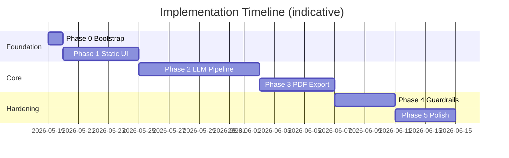
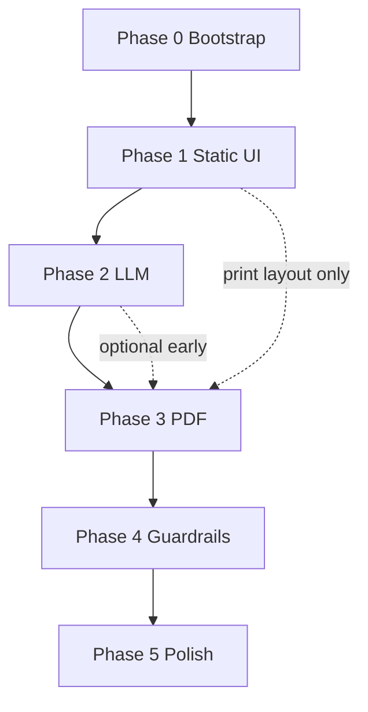

# Resume Shapeshifter — Phase-Wise Implementation Plan

> **Source:** [architecture.md](./architecture.md) · [problemStatement.md](./problemStatement.md)  
> **Stack:** Next.js 14+ (App Router), TypeScript, Tailwind, Shadcn UI, Zod, **Groq** (directly via `GROQ_API_KEY`), Playwright or React-PDF for PDFs.

This plan breaks the architecture into **five shippable phases**. Each phase ends with a demoable milestone, explicit file deliverables, and acceptance criteria. Phases are sequential; tasks within a phase can often be parallelized where noted.

---

## Overview

| Phase | Name | Duration (est.) | Outcome |
|-------|------|-----------------|---------|
| **0** | Project bootstrap | 0.5–1 day | Repo scaffold, schemas, tooling |
| **1** | Static prototype | 3–5 days | Full UI flow with mock `TailoringRun` |
| **2** | LLM integration | 5–8 days | Real pipeline: parse → score → gap → tailor |
| **3** | PDF export | 3–5 days | Tailored + comparison PDFs |
| **4** | Guardrails & review | 3–4 days | Rule engine, bullet review, export gate |
| **5** | Polish & demo | 2–4 days | Production-ready portfolio demo |

**Total estimate:** ~3–4 weeks for a solo developer working part-time; ~1.5–2 weeks full-time.



---

## Phase 0 — Project Bootstrap

**Goal:** Runnable Next.js app with shared types, linting, and folder layout matching architecture §19.

### Tasks

| # | Task | Owner | Depends on |
|---|------|-------|------------|
| 0.1 | `npx create-next-app@latest` with App Router, TS, Tailwind, ESLint | — | — |
| 0.2 | Install Shadcn UI; configure `components/ui/` | — | 0.1 |
| 0.3 | Install Zod; create `lib/schemas.ts` with all domain schemas | — | 0.1 |
| 0.4 | Add path aliases (`@/lib`, `@/components`, `@/prompts`) in `tsconfig` | — | 0.1 |
| 0.5 | Create empty module stubs per architecture §19 | — | 0.3 |
| 0.6 | Add `.env.example` (`GROQ_API_KEY`, `GROQ_MODEL`, `MAX_UPLOAD_MB`) | — | 0.1 |
| 0.7 | Add `public/fixtures/` sample resume + JD text files | — | — |
| 0.8 | Configure Vitest (or Jest) + one smoke test for schemas | — | 0.3 |

### Deliverables

```
lib/schemas.ts          # ResumeProfile, JobDescriptionProfile, MatchScore, etc.
lib/*.ts                # Empty exports or throw "not implemented"
prompts/*.ts            # Placeholder prompt strings
.env.example
README.md               # Setup + scripts
tests/schemas.test.ts   # Valid/invalid fixture parsing
```

### Acceptance criteria

- [ ] `npm run dev` serves without errors
- [ ] All Zod schemas parse golden JSON fixtures in `tests/fixtures/`
- [ ] Folder structure matches architecture §19

### Exit milestone

**“Empty shell”** — types and layout exist; no product logic yet.

---

## Phase 1 — Static Prototype

**Goal:** End-to-end **UI flow** with **mock data** — no LLM, no PDF. Validates UX, components, and `TailoringRun` shape before API cost.

**Architecture focus:** Presentation layer + schemas only (architecture §17, Phase 1).

### Tasks

#### 1.1 Layout & navigation

| # | Task | Files |
|---|------|-------|
| 1.1.1 | Landing page: value prop, CTA → `/tailor` | `app/page.tsx` |
| 1.1.2 | App shell: header, step indicator (Input → Analyze → Results → Review → Export) | `app/tailor/layout.tsx` |
| 1.1.3 | Wire routes: `/tailor`, `/tailor/results/[runId]`, `/tailor/review/[runId]`, `/tailor/export/[runId]` | `app/tailor/**` |

#### 1.2 Input screens

| # | Task | Files |
|---|------|-------|
| 1.2.1 | `ResumeInput`: textarea + “Load sample” | `components/ResumeInput.tsx` |
| 1.2.2 | `JDInput`: textarea + char count + sample loader | `components/JDInput.tsx` |
| 1.2.3 | Submit → generate mock `runId`, store in `sessionStorage` | `lib/mock-run.ts` |
| 1.2.4 | Optional: disabled file upload UI (no backend yet) | `ResumeInput.tsx` |

#### 1.3 Mock data layer

| # | Task | Files |
|---|------|-------|
| 1.3.1 | `createMockTailoringRun(resumeText, jdText)` returning full `TailoringRun` | `lib/mock-run.ts` |
| 1.3.2 | Mock includes: JD profile, original/tailored scores, 3+ rewritten bullets with metadata, 4+ gaps | `public/fixtures/mock-run.json` |
| 1.3.3 | `POST /api/runs` returns mock after 1.5s delay (simulates loading) | `app/api/runs/route.ts` |

#### 1.4 Results & review UI

| # | Task | Files |
|---|------|-------|
| 1.4.1 | `ScoreCard`: overall + sub-scores, “estimate” label | `components/ScoreCard.tsx` |
| 1.4.2 | `JDSummary`: chips for skills, tools, seniority | `components/JDSummary.tsx` |
| 1.4.3 | `GapAnalysis`: table/cards with importance badges | `components/GapAnalysis.tsx` |
| 1.4.4 | `SideBySideDiff`: two columns, expand metadata per bullet | `components/SideBySideDiff.tsx` |
| 1.4.5 | `BulletReviewRow`: static accept/edit UI (no persistence yet) | `components/BulletReviewRow.tsx` |
| 1.4.6 | Results page composes all components from `sessionStorage` or API | `app/tailor/results/[runId]/page.tsx` |

#### 1.5 Export placeholder

| # | Task | Files |
|---|------|-------|
| 1.5.1 | Export page with disabled “Download PDF” + copy: “Available in Phase 3” | `app/tailor/export/[runId]/page.tsx` |
| 1.5.2 | Browser print preview of comparison layout (CSS only, no server PDF) | `app/export/[runId]/page.tsx` |

### Parallelization

- **Track A:** Input components + mock API (1.2, 1.3)  
- **Track B:** Results components (1.4) — can use `mock-run.json` directly  
- **Track C:** Landing + layout (1.1)

### Acceptance criteria

- [ ] User can paste resume + JD (or load samples) and click **Analyze**
- [ ] Loading skeleton shown during mock delay
- [ ] Results show original vs tailored scores, JD summary, gaps, side-by-side bullets
- [ ] Each mock bullet shows `changeReason`, `keywordsAddressed`, `confidence`
- [ ] Refresh with `runId` in URL restores state from `sessionStorage`
- [ ] Print route renders comparison layout in browser (Print → Save as PDF works manually)

### Definition of done (Phase 1)

Matches architecture **week 1 vertical slice**: paste → mock API → `SideBySideDiff` in browser.

### Exit milestone

**“Clickable product”** — stakeholders can walk the full journey with realistic fake data.

---

## Phase 2 — LLM Integration (Groq)

**Goal:** Replace mocks with a **real pipeline orchestrator** and **Groq-backed** LLM engines. Text-only resume input first; file upload in Phase 2 late or Phase 3.

**Architecture focus:** `lib/llm.ts` (Groq client), `lib/pipeline.ts`, prompts, API routes (architecture §6, §7, §10).

**LLM provider:** [Groq](https://groq.com/) directly using the `GROQ_API_KEY` for fast chat completions with JSON mode. API key from [Groq Console](https://console.groq.com/). Default model: `llama-3.3-70b-versatile` (quality) or `llama-3.1-8b-instant` (speed/cost).

### Tasks

#### 2.1 LLM infrastructure (Groq)

| # | Task | Files |
|---|------|-------|
| 2.1.0 | Install `groq-sdk`; add `GROQ_API_KEY` + `GROQ_MODEL` to `.env.local` | `package.json`, `.env.example` |
| 2.1.1 | `completeStructured<T>()` — Groq chat completions + `response_format: json_object` + Zod parse + 1 retry | `lib/llm.ts` |
| 2.1.2 | `system-truthfulness.ts` shared preamble | `prompts/system-truthfulness.ts` |
| 2.1.3 | Structured logging: `runId`, `stage`, `durationMs`, `tokenUsage` (no PII) | `lib/logger.ts` |
| 2.1.4 | In-memory `Map<runId, TailoringRun>` store (MVP) | `lib/run-store.ts` |

**Groq client notes**

- Base URL: `https://api.groq.com` (override via `GROQ_BASE_URL`).
- Never import `groq-sdk` or read `GROQ_API_KEY` in client components — server-only (`lib/llm.ts`, API routes).
- Handle Groq rate limits (429) with backoff; map to `RATE_LIMIT` error code.
- On missing `GROQ_API_KEY`, return clear 503 from `/api/runs` with setup instructions.

#### 2.2 Prompts (one per engine)

| # | Task | Files |
|---|------|-------|
| 2.2.1 | JD extraction → `JobDescriptionProfile` | `prompts/jd-extraction.ts`, `lib/jd-parser.ts` |
| 2.2.2 | Resume text cleanup → `ResumeProfile` | `prompts/resume-parser.ts`, `lib/resume-parser.ts` |
| 2.2.3 | Match scoring → `MatchScore` | `prompts/match-scoring.ts`, `lib/scoring.ts` |
| 2.2.4 | Gap analysis → `ResumeGap[]` | `prompts/gap-analysis.ts`, `lib/gaps.ts` |
| 2.2.5 | Bullet rewriter (batched per job) → `TailoredResume` | `prompts/bullet-rewriter.ts`, `lib/tailoring.ts` |
| 2.2.6 | Optional: summary + skills reorder | `prompts/resume-assembly.ts` |
| 2.2.7 | Scoring weights config | `lib/scoring-weights.ts` |

#### 2.3 Deterministic resume parsing (pre-LLM)

| # | Task | Files |
|---|------|-------|
| 2.3.1 | Section splitter (Experience, Education, Skills, etc.) | `lib/resume-parser.ts` |
| 2.3.2 | LLM cleanup only when sections ambiguous; set `parseWarnings` | `lib/resume-parser.ts` |
| 2.3.3 | Preserve `rawText` on `ResumeProfile` | `lib/resume-parser.ts` |

#### 2.4 Pipeline orchestrator

| # | Task | Files |
|---|------|-------|
| 2.4.1 | `runPipeline(input): TailoringRun` with status transitions | `lib/pipeline.ts` |
| 2.4.2 | Stage order: parse resume → parse JD → original match → gaps → tailor → tailored match | `lib/pipeline.ts` |
| 2.4.3 | On failure: `status: failed`, `errors[]`, preserve partial data where safe | `lib/pipeline.ts` |
| 2.4.4 | Cap rewritten bullets (e.g. 20) for cost control | `lib/tailoring.ts` |
| 2.4.5 | `tailoredResumeToProfile()` helper for second scoring pass | `lib/tailoring.ts` |

#### 2.5 API routes

| # | Task | Files |
|---|------|-------|
| 2.5.1 | `POST /api/parse/resume` | `app/api/parse/resume/route.ts` |
| 2.5.2 | `POST /api/parse/jd` | `app/api/parse/jd/route.ts` |
| 2.5.3 | `POST /api/runs` — calls pipeline, returns `TailoringRun` | `app/api/runs/route.ts` |
| 2.5.4 | `GET /api/runs/[id]` | `app/api/runs/[id]/route.ts` |
| 2.5.5 | Standard error JSON (`code`, `message`, `stage`) | shared `lib/api-error.ts` |

#### 2.6 Frontend integration

| # | Task | Files |
|---|------|-------|
| 2.6.1 | Replace mock submit with real `POST /api/runs` | `app/tailor/page.tsx` |
| 2.6.2 | Stage-based loading messages (Parsing → Scoring → Tailoring…) | `components/PipelineProgress.tsx` |
| 2.6.3 | Error toasts + preserve form inputs on failure | tailor pages |
| 2.6.4 | Label scores as **estimates** in `ScoreCard` | `components/ScoreCard.tsx` |

#### 2.7 File upload (stretch within Phase 2)

| # | Task | Files |
|---|------|-------|
| 2.7.1 | PDF text extract (`pdf-parse`), 5 MB limit | `lib/resume-parser.ts` |
| 2.7.2 | DOCX extract (`mammoth`) | `lib/resume-parser.ts` |
| 2.7.3 | `multipart/form-data` on `POST /api/runs` | `app/api/runs/route.ts` |

### Suggested implementation order

```
2.1 → 2.2.1 (JD) → 2.3 (resume text) → 2.2.3 (score) → 2.2.4 (gaps) → 2.2.5 (tailor) → 2.4 → 2.5 → 2.6
```

Test each engine in isolation with fixture files before wiring the orchestrator.

### Acceptance criteria

- [ ] Paste real resume + real JD → complete `TailoringRun` with `status: complete`
- [ ] `originalMatch` and `tailoredMatch` both populated with explanations
- [ ] ≥1 bullet rewritten with `changeReason` and `keywordsAddressed`
- [ ] Gap list includes at least one `canSafelyAdd: false` item when JD has unmet reqs
- [ ] Invalid LLM JSON triggers retry once, then readable error
- [ ] No employers/degrees appear in tailored output that were not in original (manual spot-check)
- [ ] `GROQ_API_KEY` never exposed to client; app fails gracefully when key is missing

### Definition of done (Phase 2)

Architecture §20 items **1–4** (pipeline, scores, bullet metadata, honest gaps) — without PDF and without programmatic guardrails.

### Exit milestone

**“Intelligent MVP”** — real tailoring run end-to-end in the browser.

---

## Phase 3 — PDF Export

**Goal:** Generate **tailored resume PDF** and **side-by-side comparison PDF** (proof artifact).

**Architecture focus:** Print route + PDF service (architecture §11, §6.6).

### Tasks

#### 3.1 Print-optimized comparison view

| # | Task | Files |
|---|------|-------|
| 3.1.1 | `/export/[runId]` — minimal chrome, print CSS (`@media print`) | `app/export/[runId]/page.tsx` |
| 3.1.2 | Sections: header (title, company), score strip, JD summary, two-column bullets, gap table, disclaimer | same |
| 3.1.3 | Highlight changed bullets (background + icon) | `components/PrintComparison.tsx` |
| 3.1.4 | Appendix table: reason, keywords, confidence per changed bullet | same |

#### 3.2 Tailored resume view

| # | Task | Files |
|---|------|-------|
| 3.2.1 | `/export/[runId]/resume` — single-column ATS-friendly layout | `app/export/[runId]/resume/page.tsx` |
| 3.2.2 | Sections: contact, summary, skills, experience, education | `components/PrintResume.tsx` |

#### 3.3 PDF generation service

| # | Task | Decision |
|---|------|----------|
| 3.3.1 | **Choose renderer:** Playwright (HTML→PDF) *or* `@react-pdf/renderer` | See architecture §6.6 |
| 3.3.2 | `generateComparisonPdf(runId)` → `Buffer` | `lib/pdf.ts` |
| 3.3.3 | `generateTailoredResumePdf(runId)` → `Buffer` | `lib/pdf.ts` |
| 3.3.4 | If Playwright: hit local `http://localhost:3000/export/...` with `page.pdf()` | `lib/pdf.ts` |

**Vercel note:** If serverless blocks Playwright, add a small Railway/Fly worker or switch comparison PDF to React-PDF (architecture §16).

#### 3.4 Export API & UI

| # | Task | Files |
|---|------|-------|
| 3.4.1 | `POST /api/runs/[id]/export` — returns PDF streams or base64 | `app/api/runs/[id]/export/route.ts` |
| 3.4.2 | Enable `PDFExportButton`; download both files | `components/PDFExportButton.tsx` |
| 3.4.3 | `DisclaimerModal` copy (no ATS guarantee; verify before use) | `components/DisclaimerModal.tsx` |

#### 3.5 Hydration for print routes

| # | Task | Files |
|---|------|-------|
| 3.5.1 | Print routes load run from server store or `GET /api/runs/[id]` | export pages |
| 3.5.2 | Handle missing run → 404 page | `app/export/[runId]/not-found.tsx` |

### Acceptance criteria

- [ ] **Comparison PDF** includes: header, both scores, JD summary, side-by-side bullets, highlights, gap summary, disclaimer
- [ ] **Tailored resume PDF** is readable, single-column, suitable for submission
- [ ] Browser “Print to PDF” from `/export/[runId]` matches server-generated comparison PDF closely
- [ ] Export completes in &lt;30s on sample run (local dev)
- [ ] PDFs contain no raw API keys or internal debug strings

### Definition of done (Phase 3)

Architecture §20 item **6** — two PDFs with required sections.

### Exit milestone

**“Proof artifact”** — portfolio demo can attach side-by-side PDF.

---

## Phase 4 — Guardrails & User Review

**Goal:** Programmatic truthfulness checks, per-bullet review, and **export gate** before PDF generation.

**Architecture focus:** `lib/guardrails.ts`, review UI, export gate (architecture §8).

### Tasks

#### 4.1 Guardrail rule engine

| # | Task | Files |
|---|------|-------|
| 4.1.1 | `validateTailoredResume(original, tailored): GuardrailResult` | `lib/guardrails.ts` |
| 4.1.2 | Reject/strip: new employers, schools, certs | `lib/guardrails.ts` |
| 4.1.3 | Flag: new metrics, new tools/skills in bullets, seniority inflation | `lib/guardrails.ts` |
| 4.1.4 | Warn: keyword density spike vs original | `lib/guardrails.ts` |
| 4.1.5 | Integrate into pipeline after tailor; attach warnings to run | `lib/pipeline.ts` |
| 4.1.6 | Unit tests with adversarial LLM outputs | `tests/guardrails.test.ts` |

#### 4.2 Prompt hardening

| # | Task | Files |
|---|------|-------|
| 4.2.1 | Audit all prompts include `system-truthfulness` preamble | `prompts/*.ts` |
| 4.2.2 | Bullet prompt: explicit “do not fill `canSafelyAdd: false` gaps” | `prompts/bullet-rewriter.ts` |
| 4.2.3 | Downgrade `confidence` in prompt examples for edge cases | `prompts/bullet-rewriter.ts` |

#### 4.3 Review UI

| # | Task | Files |
|---|------|-------|
| 4.3.1 | `PATCH /api/runs/[id]/bullets` — save edits + `userConfirmed` | `app/api/runs/[id]/bullets/route.ts` |
| 4.3.2 | Accept / revert / inline edit per bullet | `components/BulletReviewRow.tsx` |
| 4.3.3 | Amber = low confidence; red = `riskFlag` present | `SideBySideDiff.tsx` |
| 4.3.4 | Block export if any high-risk bullet lacks `userConfirmed` | `app/tailor/export/[runId]/page.tsx` |

#### 4.4 Export gate

| # | Task | Files |
|---|------|-------|
| 4.4.1 | Checkbox: “I have verified all content is accurate” | `DisclaimerModal.tsx` |
| 4.4.2 | `POST /api/runs/[id]/export` returns `GUARDRAIL_VIOLATION` if unchecked or blocked | export route |
| 4.4.3 | PDF footer includes disclaimer text | print components |

### Acceptance criteria

- [ ] Injecting a fake “Google 2020” employer in tailored output is **stripped or rejected**
- [ ] New metric “increased revenue 40%” without source → `riskFlag` set
- [ ] User cannot export until disclaimer checked and risky bullets confirmed
- [ ] Guardrail unit tests pass in CI
- [ ] Pipeline still completes when guardrails only **warn** (non-blocking)

### Definition of done (Phase 4)

Architecture §20 item **5** — guardrails block or flag unsupported claims.

### Exit milestone

**“Trustworthy MVP”** — safe enough to show in a portfolio without misleading employers.

---

## Phase 5 — Polish & Demo

**Goal:** Portfolio-ready UX, documentation, demo script, and deployment.

**Architecture focus:** UX, samples, observability, deployment (architecture §15–16, Appendix C).

### Tasks

#### 5.1 UX polish

| # | Task | Files |
|---|------|-------|
| 5.1.1 | Skeleton loaders on all async views | components |
| 5.1.2 | Empty states + validation (min length for resume/JD) | `ResumeInput`, `JDInput` |
| 5.1.3 | Responsive layout for mobile review | Tailwind breakpoints |
| 5.1.4 | Accessible forms (labels, focus, aria on score cards) | components |

#### 5.2 Samples & onboarding

| # | Task | Files |
|---|------|-------|
| 5.2.1 | Curated **demo resume** + **real job listing** in `public/fixtures/` | fixtures |
| 5.2.2 | “Try demo” one-click on landing | `app/page.tsx` |
| 5.2.3 | README: setup, env vars, demo steps | `README.md` |
| 5.2.4 | `DEMO.md` script: talking points + expected scores | `project_docs/DEMO.md` |

#### 5.3 Reliability & ops

| # | Task | Files |
|---|------|-------|
| 5.3.1 | Rate limit `POST /api/runs` (per IP) | middleware or route |
| 5.3.2 | `clientRequestId` header for idempotency (optional) | `app/api/runs/route.ts` |
| 5.3.3 | Delete temp uploads / runs after 24h (document behavior) | `lib/run-store.ts` |
| 5.3.4 | Deploy to Vercel; document PDF worker if needed | README |

#### 5.4 Quality verification

| # | Task | Files |
|---|------|-------|
| 5.4.1 | Run Appendix C demo checklist end-to-end | `project_docs/architecture.md` |
| 5.4.2 | Screenshot or record 2-min demo GIF for README | `public/` |
| 5.4.3 | Schema + guardrail tests in GitHub Actions (optional) | `.github/workflows/ci.yml` |

### Acceptance criteria (final)

Full **Definition of Done** from architecture §20:

- [ ] Single `TailoringRun` through all stages with validated schemas
- [ ] Original + tailored scores with explanations
- [ ] Bullet metadata on every rewrite
- [ ] Honest gap analysis (no auto-invented experience)
- [ ] Guardrails + user review before export
- [ ] Two PDFs with scores, diff, gaps, disclaimer
- [ ] `DEMO.md` reproducible on a fresh clone

### Exit milestone

**“Portfolio ship”** — project ready to share with recruiters and on GitHub.

---

## Cross-Phase Dependencies



| Dependency | Notes |
|------------|-------|
| Phase 2 → 3 | Need real `TailoringRun` in store for PDF content |
| Phase 1 print layout → 3 | Can build `/export/[runId]` with mock data in Phase 1; wire data in Phase 3 |
| Phase 4 → 3 export gate | Export API should enforce guardrails; can add gate in Phase 4 without rewriting PDFs |
| Phase 5 | Can start sample fixtures in Phase 1; finalize in Phase 5 |

---

## Testing Strategy by Phase

| Phase | Tests |
|-------|-------|
| 0 | Zod schema golden files |
| 1 | Manual UX walkthrough; optional Playwright smoke (landing → results) |
| 2 | Per-engine fixture tests; one integration test with mocked LLM |
| 3 | Snapshot or hash check on generated PDF byte length; manual visual QA |
| 4 | `guardrails.test.ts` adversarial cases |
| 5 | Full E2E demo script (manual or Playwright) |

---

## Risk Checkpoints

Schedule explicit reviews at these points:

| After phase | Review question |
|-------------|-----------------|
| 1 | Is the UX flow clear without AI? |
| 2 | Does tailored output stay truthful on 3 different real JDs? |
| 3 | Is comparison PDF readable and impressive in &lt;2 pages of bullets? |
| 4 | Do guardrails catch obvious fabrications? |
| 5 | Does a stranger reproduce the demo from README alone? |

---

## Optional Post-MVP Backlog

Tracked separately — not required for portfolio MVP:

| Item | Architecture ref |
|------|------------------|
| Job posting URL fetch + text extract | JD input §7.2 |
| SQLite / Supabase persistence + auth | §12.2 |
| Async pipeline with polling | §6.7 |
| Cover letter generation | Non-goal |
| DOCX export | problem statement §8 |
| OpenTelemetry tracing | §15 |
| Python FastAPI parser sidecar | §3 |

---

## Quick Reference — Files Created Per Phase

| Phase | Primary new/changed files |
|-------|---------------------------|
| 0 | `lib/schemas.ts`, stubs, `tests/schemas.test.ts` |
| 1 | `components/*`, `app/tailor/**`, `lib/mock-run.ts`, `app/api/runs/route.ts` (mock) |
| 2 | `lib/llm.ts`, `lib/pipeline.ts`, `lib/*-parser.ts`, `lib/scoring.ts`, `lib/tailoring.ts`, `lib/gaps.ts`, `prompts/*`, `app/api/**` |
| 3 | `lib/pdf.ts`, `app/export/**`, `app/api/runs/[id]/export/route.ts`, `PDFExportButton.tsx` |
| 4 | `lib/guardrails.ts`, `tests/guardrails.test.ts`, `PATCH` bullets route, export gate |
| 5 | `README.md`, `DEMO.md`, fixtures, CI, deployment config |

---

## Suggested First Sprint (Week 1)

If time-boxed to one week, ship **Phase 0 + Phase 1 + start Phase 2**:

| Day | Focus |
|-----|-------|
| 1 | Phase 0 complete |
| 2–3 | Phase 1 input + mock API + results page |
| 4 | Phase 1 review + print layout |
| 5 | Phase 2: `llm.ts` + JD parser + resume text parser |
| 6–7 | Phase 2: scoring + wire `POST /api/runs` (gaps/tailor can follow in week 2) |

---

*Document version: 1.0 — aligned with [architecture.md](./architecture.md)*
